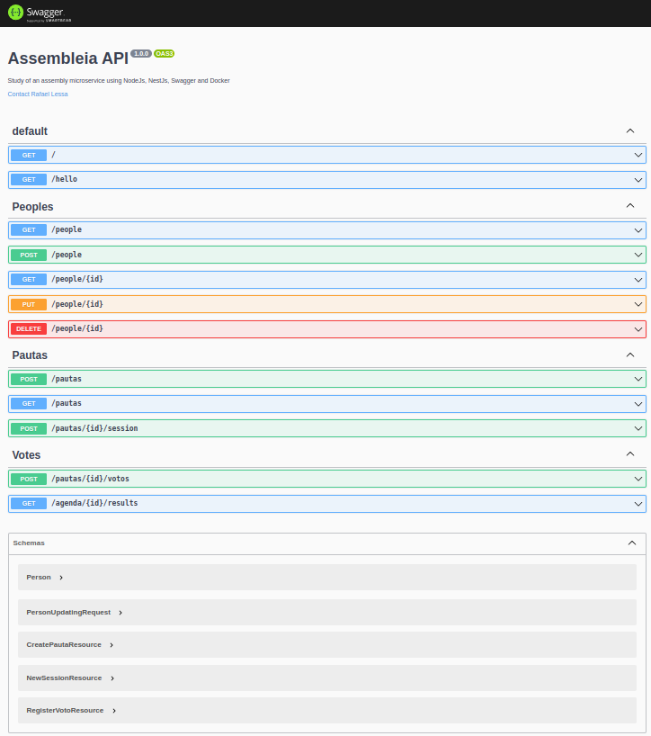
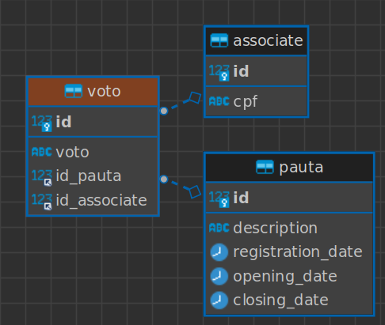

# Assembleia-api

The microservice Assembleia-api was developed for NestJs studies in NodeJs to understand how the framework works. In this example, we have the ability to create an agenda for voting, estimate the time, vote, and display the voting results. Swagger has also been added so that we can easily identify the involved endpoints.
Note: The endpoints of the People entity were created just to get an idea of how to implement a CRUD; they are not actually part of the assembly since the purpose is for programming language studies.

## Installation

Having downloaded the project from https://github.com/Rafaellcx/assembleia, access the project's main folder via the terminal and execute the following commands:

#### 1 - Create a new network:

```sh 
docker network create net-assembleia
```
#### 2 - Create a mysql container:
```sh 
docker run --name assembleia-mysql -e MYSQL_ROOT_PASSWORD=root -e MYSQL_DATABASE=assembleia -p 3306:3306 --network net-assembleia -d mysql:8.0.32
```
#### 3 - Creates an image of the assembly-api microservice:
```sh 
docker build --tag assembleia-api .
```
#### 4 - Creates a microservice container from the image created in the previous step.
```sh 
docker run --name assembleia-api -p 3000:3000 --network net-assembleia -d assembleia-api
```

## Api Documentation
Now we can use the application through the address "http://localhost:3000/api"

## ER Diagram

